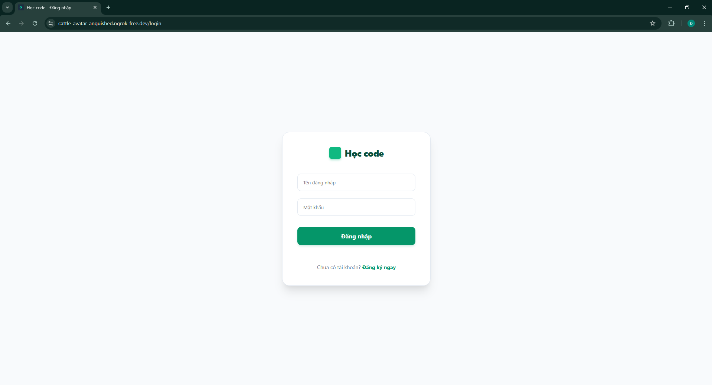
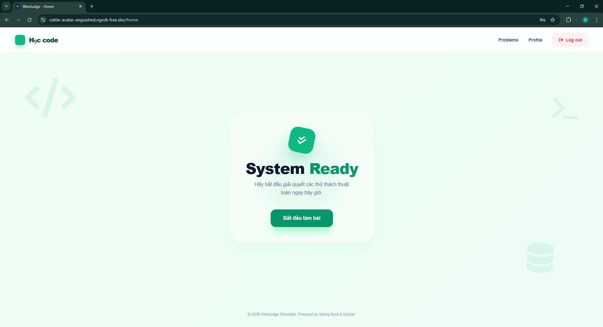
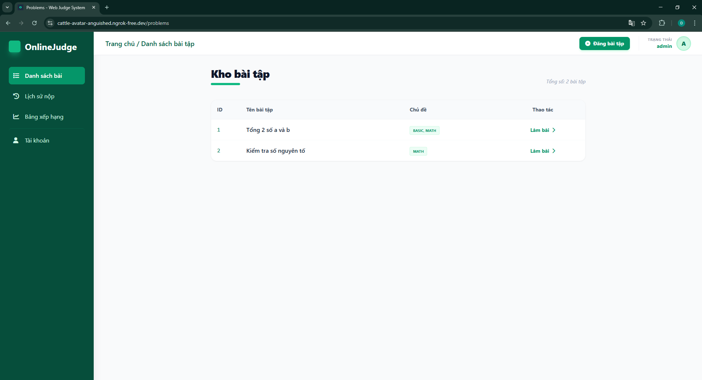
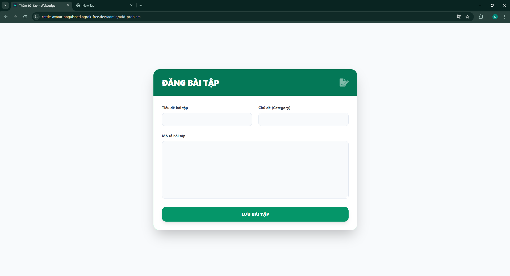
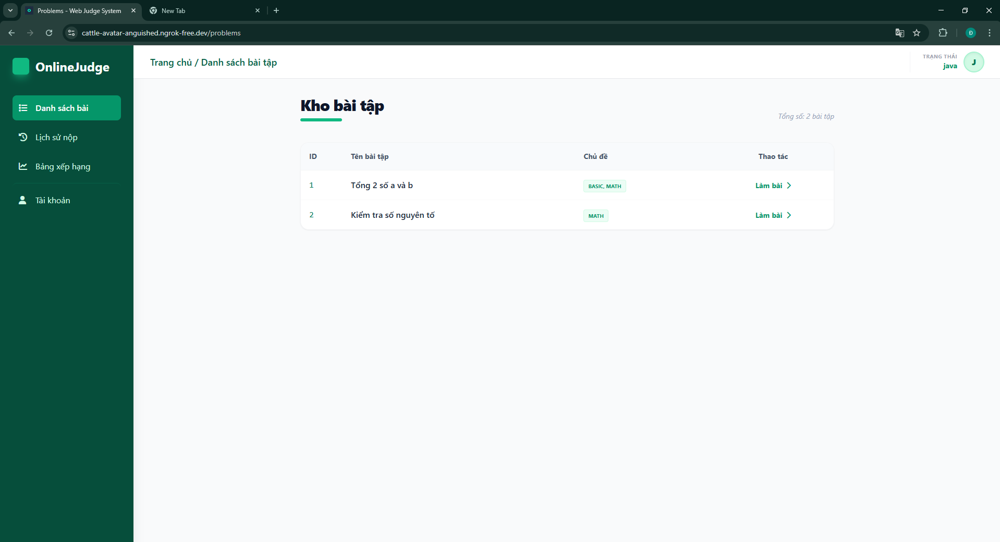
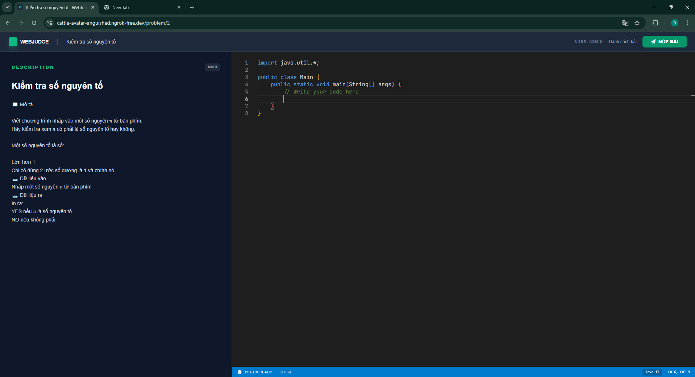
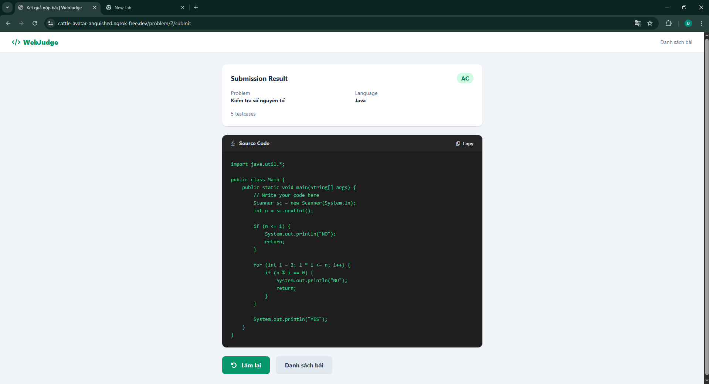
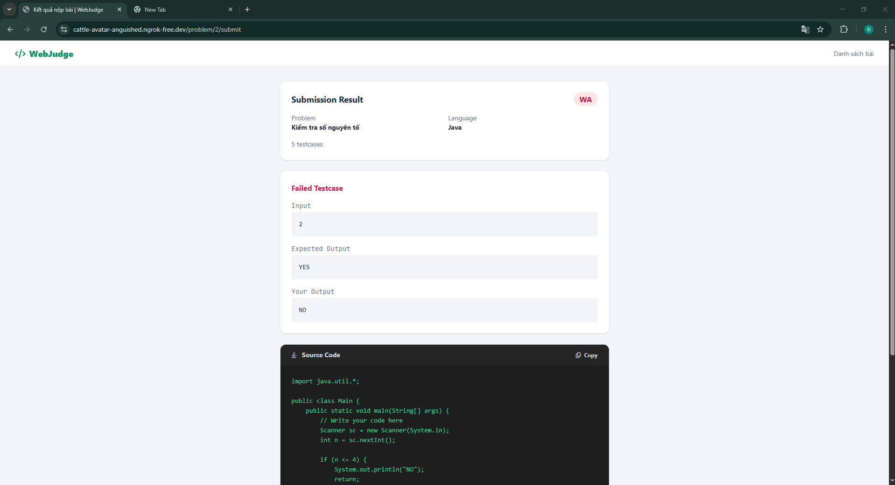
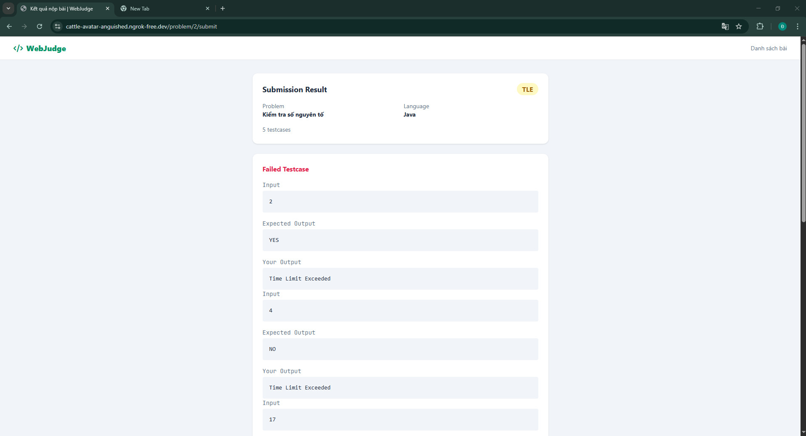

#LeetCode Simulator
Demo: https://cattle-avatar-anguished.ngrok-free.dev/login

##Brief Description
An website that mimics functionalities of online judge system.
It allows users to write, submit, and evaluate Java solutions against predefined test cases.
This project is built to support a few students struggle with module introductory programming in university learning basic programming and algorithms,
the application focuses on clarity, simplicity, and educational value.

##Tech Stack
- Backend: Spring Boot(Java)
- Session Management: Http Session
- Build Tool: Maven
- Database: MySQL

##System Architecture
- RESTful API for submission handling
- HTTP Session to track user state
- Judge Service to:
- Compile Java code dynamically
- Execute against test cases
- Return verdict (Accepted / Wrong Answer / Runtime Error)
- Deployment: Docker, Ngrok

##Core Features
###Login Page
- Security login system for users
- Passwords are hashed before storing (e.g., BCrypt)
- Role-based access control(Admin/Member)

###Dashboard
- View a welcome message for the user
- Simple and friendly interface for users

###Problem Page
- Display a list of available programming problems
- Show problem titles and descriptions
- Allow users to view detailed problem statements
- Admin can manage and post new problems with convenient add-problem interface

###Code Editor Page
- Interactive code editor for writing and editing Java code
- Display the problem details alongside the editor box
- Submit code directly for evaluation

###Result Page
- Display the result of code execution
- Show verdict: Accepted, Wrong Answer, Time Limit Exceeded, Runtime Error, Compile Error
- Provide feedback for each submission

##Usage
The system has been deployed and actively used by a small group of students studying introductory programming.
It was designed to assist learners who had difficulty passing basic programming courses.
By providing a simple and interactive coding environment, the platform helped users better understand problem-solving and improve their coding skills.

